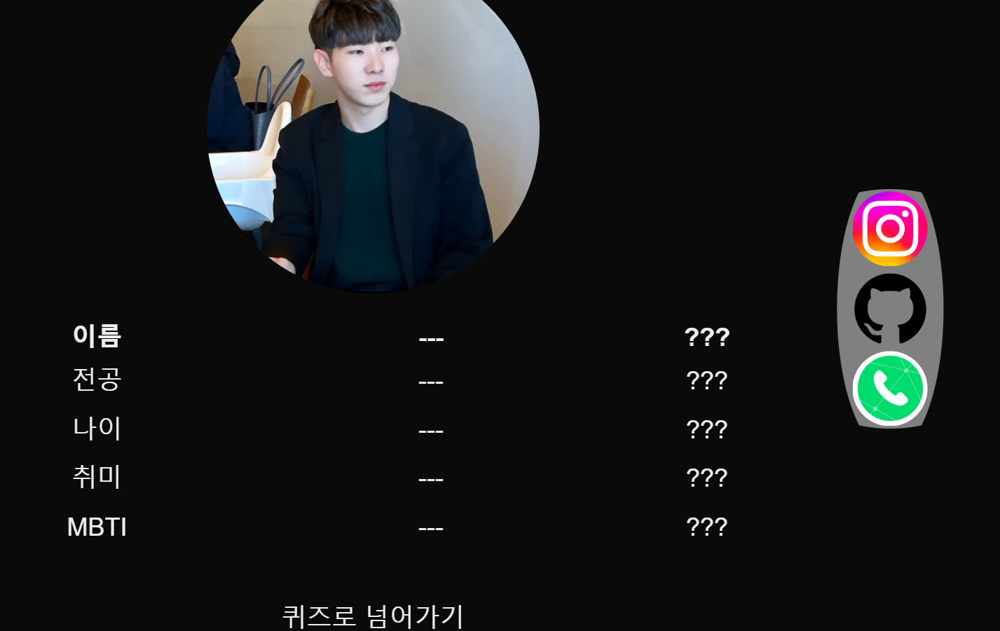
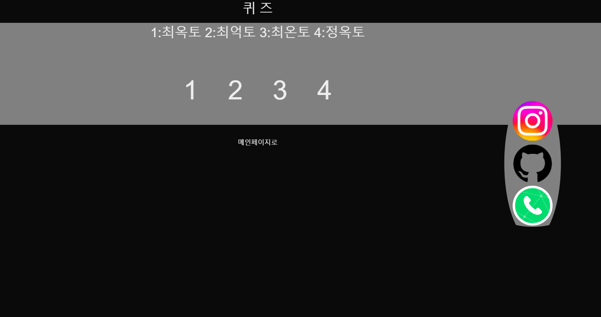
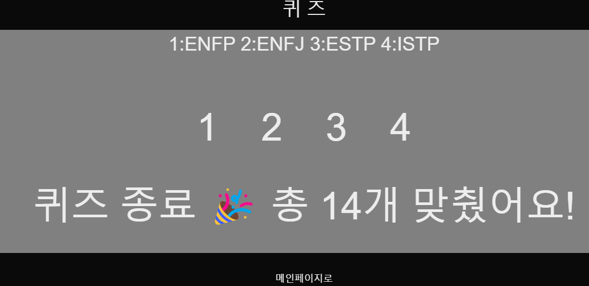

# OktoChoi
PARD 5기 웹파트-웹파디 최옥토

이번에 만든 웹사이트는 간단한 자기소개로 크게는 총 2페이지로(index, quiz) 구성되어있습니다.

<index.tsl>

먼저 index페이지를 살펴보면 간단한 자바스크립트 코드로
???에 대해서 저에 대한 정보를 넣을 수 있게 만들어 봤습니다.

추가로 사이드바에는 제 깃허브,인스타 사이트 주소를 넣어줬습니다.

quiz페이지로 넘어가면

앞서 들은 저에 정보에 대한 퀴즈를 준비해봤습니다.
숫자와 정보를 클릭해서 각각의 문제를 맞출수 있습니다.

<개선점>

아직 코드 만드는데 미숙해서 퀴즈 페이지를 연속으로 누르면 누른 수 만큼 정답이 체크되어 총 개수를 늘릴수 있는 버그가 있습니다.

<업데이트>
이번 과제는 타입스크립트를 적용하는 과제였습니다.
솔직히 어려워서 아직도 모르겠는데, 일단 최선을 다해서 느낌만 내봤습니다....

<개선한점> 
정답을 체크하면 이제 버튼이 없어져요~~~~
